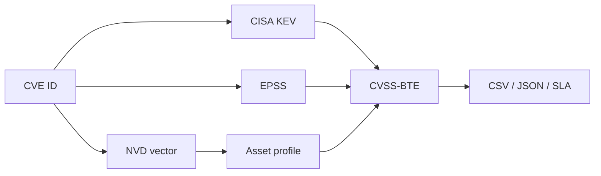

# cvss_4.0

CVSS v4.0 BTE enrichment CLI that turns CVEs into prioritized vulnerability-management work using NVD, CISA KEV, EPSS, and asset profiles.


## Demo

Add an 8-15 second GIF showing: CVE input -> enrichment -> BTE vector -> SLA recommendation -> CSV/JSON export.

## What This Is For

A vulnerability manager or SOC lead runs this when raw CVSS-B scores are not enough. It adds threat and environmental context so prioritization reflects exploitability and asset impact.

## Why CVSS-BTE, Not CVSS-B

CVSS-B describes technical severity. CVSS-BTE adds threat and environmental context, which is closer to the patching decision defenders actually have to make.

## What It Produces

| Output | Use |
|---|---|
| CVSS-BTE vector | Prioritization |
| CSV export | Work queues |
| JSON export | Automation |
| SLA recommendation | Patch planning |
| Asset-profile adjustment | Environment-aware scoring |

## Quick Start

```bash
git clone https://github.com/anpa1200/cvss_4.0.git
cd cvss_4.0
python3 -m venv .venv
source .venv/bin/activate
pip install -r requirements.txt
python cvss4.py CVE-2024-0000 --profile internet_facing --json
```

## How It Works



## Coverage

| Area | Coverage |
|---|---|
| Sources | NVD, CISA KEV, EPSS |
| Profiles | internet_facing, internal_vlan, isolated_ot, dev_test, healthcare_ehr, pci_payment |
| Exports | CSV, JSON |
| Dependency model | Single dependency |

## Sample SLA Output

```text
CVE: CVE-2024-0000
Profile: internet_facing
Threat: KEV=true, EPSS=high
Recommendation: patch within 72 hours
```

## Naming Note

Consider renaming to `cvss-bte` for clarity. GitHub redirects old URLs after rename.

## Limitations And Honesty

This tool supports prioritization. It does not prove exploitability in your environment and does not replace asset-owner validation.

## Companion Article

https://medium.com/bugbountywriteup/cvss-v4-0-the-practical-field-guide-for-vulnerability-management-5b5a59728456

## Documentation Site

https://anpa1200.github.io/cvss/

## Citation

See `CITATION.cff`.

## License

MIT recommended.

## Security Policy

See `SECURITY.md`.
